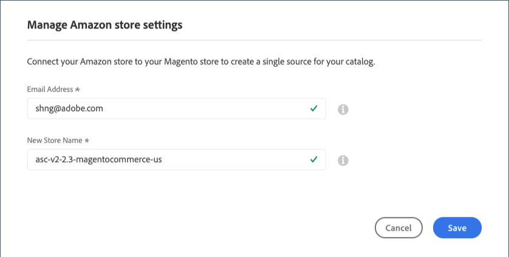

# [!UICONTROL Store Integration Settings]

整合您的商店後，請透過[!UICONTROL Amazon Store]儀表板檢閱並設定商店整合設定。 這些設定會顯示給&#x200B;*非使用中*&#x200B;和&#x200B;*使用中*&#x200B;存放區。 您可以在此處變更Amazon商店的名稱，以及在商店整合期間與商店相關聯的電子郵件地址。

## 修改商店整合設定

1. 若要顯示商店[儀表板](./amazon-store-dashboard.md)，請按一下商店卡片中的&#x200B;**[!UICONTROL View Store]**。

1. 按一下左側功能表中的&#x200B;**[!UICONTROL Store Integration Settings]**。

1. 針對&#x200B;**[!UICONTROL Email Address]**，更新您偏好的連絡人電子郵件地址。

1. 針對&#x200B;**[!UICONTROL New Store Name]**，更新您新Amazon銷售管道商店的描述性名稱。

   此名稱會出現在[_[!UICONTROL Amazon Stores]_](./managing-stores.md)標籤上。

   它僅用作[!DNL Commerce]參考，並識別Amazon銷售管道首頁清單中的商店。 這應該是您的團隊可以輕鬆識別的東西。 例如，您在美國地區銷售的Amazon商店可能名為`Amazon Store USA`。

1. 按一下&#x200B;**[!UICONTROL Save]**。

>[!NOTE]
>
>無法更新[存放區整合](./store-integration.md)期間定義的&#x200B;_[!UICONTROL Amazon Marketplace Country]_設定。 若要編輯國家/地區設定，您必須刪除商店（位於商店卡片上的_[!UICONTROL Action]_&#x200B;下），並為不同的國家/地區新增商店。

{width="600" zoomable="yes"}
