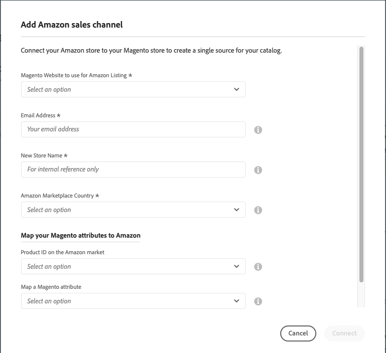
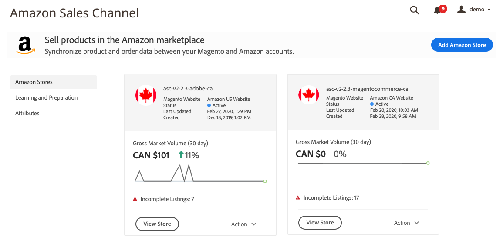

# 與的商店整合 [!DNL Amazon Seller Account]

若要開始使用Amazon sales channel，您必須建立（新增） Amazon sales channel商店，並將其連線到您的 [!DNL Amazon Seller Account]. 這兩個步驟整合您的 [!DNL Commerce] 和Amazon帳戶共用資料、同步產品等。

_您需要的主要登入認證 [!DNL Amazon Seller Central] 帳戶（用來建立賣家帳戶的電子郵件或電話）以連線您的商店。_

>[!NOTE]
>
>第一次整合商店後，系統每年會提示您再次授予存取權，以續約Amazon銷售管道與Amazon的連線。 您可以更新或撤銷此授權於 _目前的授權_ 中的表格 _Amazon MWS開發人員許可權_ 的區段 **設定** > **使用者許可權** Seller Central帳戶頁面。

## 新增Amazon存放區

1. 在 _管理員_ 側欄，前往 **行銷** > _頻道_ > **AmazonSales Channel**.

   新增您的第一個Amazon銷售管道商店時， _預先設定任務_ 強制回應視窗會出現。 新增第一個存放區後，您可在以下位置存取預先設定工作： [Amazon銷售管道首頁](./amazon-sales-channel-home.md) 頁面於 _學習與準備_ 在左側功能表中。

1. 按一下 **[!UICONTROL Add Amazon Store]**.

   此 _[!UICONTROL Add Amazon sales channel]_頁面隨即開啟。

   {width="500" zoomable="yes"}

1. 的 **[!UICONTROL Magento Website to use for Amazon Listing]**，選擇您的 [!DNL Commerce] 為此Amazon sales channel商店連線的網站。

   此設定也會定義預設值 [!DNL Commerce] 儲存 [匯入Amazon訂單](./order-settings.md).

1. 的 **[!UICONTROL Email Address]**，請輸入您偏好的連絡人電子郵件地址。

1. 的 **[!UICONTROL New Store Name]**，為您新的Amazon銷售管道商店輸入描述性名稱。

   >[!NOTE]
   >
   >此名稱用作 [!DNL Commerce] 僅供參考，並在上識別存放區 [Amazon銷售管道首頁](./amazon-sales-channel-home.md) 頁面。 您希望讓您的團隊能夠輕鬆識別它。 例如，您在美國地區銷售的Amazon商店可能會命名為 `Amazon Store USA`.

1. 的 **[!UICONTROL Amazon Marketplace Country]**，選擇此Amazon銷售管道商店銷售產品的地區/國家。 選項：

   - 美國
   - 加拿大
   - 墨西哥
   - 英國

1. 在 _[!UICONTROL Map your Magento attributes to Amazon]_區段，請執行下列動作：

   - 的 **[!UICONTROL Product ID on the Amazon market]**，選擇要對應至的Amazon屬性 [!DNL Commerce] 屬性已選取如下。

     此ID有助於正確比對您電腦中對應的產品， [!DNL Commerce] 目錄。

   - 的 **[!UICONTROL Map a Magento attribute]**，選擇 [!DNL Commerce] 對應至上述所選Amazon屬性的產品屬性。

     [對應屬性](./ob-creating-magento-attributes.md) 有助於確保您的Amazon清單正確符合中的對應產品 [!DNL Commerce] 目錄。

1. 按一下 **[!UICONTROL Connect]**.

   對話方塊關閉，新存放區出現在 [Amazon銷售管道首頁](./amazon-sales-channel-home.md) 包含確認訊息的頁面。

## 將存放區連線至 [!DNL Amazon Seller Central]

1. 在商店控制面板上，按一下 **[!UICONTROL Connect store]** 在要啟動的商店卡片上 [!DNL Amazon Seller Central] 在新標籤中。

1. 輸入您的 [!DNL Amazon Seller Central] 帳戶認證，然後按一下 **[!UICONTROL Sign in]**.

   若要完成此連線，您必須登入 [!DNL Amazon Seller Central] 使用主要使用者登入憑證的帳戶（用來建立賣家帳戶的電子郵件或電話）。

1. 如果系統提示，請輸入您從Amazon收到的程式碼，然後按一下，以完成Amazon雙因素授權(2FA) **[!UICONTROL Sign in]**.

1. 在 _[!UICONTROL Amazon Marketplace Web Service]_確認頁面，選取&quot;[!UICONTROL I understand...]」核取方塊並按一下&#x200B;**[!UICONTROL Next]**.

1. 在 _[!UICONTROL You are almost done]_訊息，按一下&#x200B;**[!UICONTROL Continue]**.

   您已授予Amazon Sales Channel存取及與共用資料的許可權 [!DNL Amazon Seller Central] 帳戶。 Amazon頁面會關閉，並顯示確認訊息。

   此 [Amazon銷售管道首頁](./amazon-sales-channel-home.md) 頁面隨即開啟，顯示您的Amazon商店資訊卡。

   若要檢視商店控制面板，請按一下 **[!UICONTROL View Store]** 在商店資訊卡上。

{width="600" zoomable="yes"}

您新的Amazon銷售管道商店現在已連線至您的 [!DNL Amazon Seller Central] 帳戶。

 [**繼續建立清單規則**](./ob-create-listing-rule.md)
