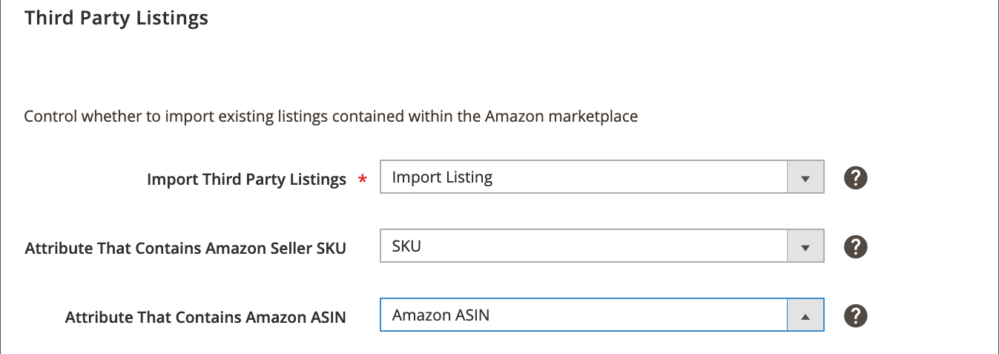

# 第三方清單

協力廠商清單設定是您商店清單設定的一部分。 清單設定可從 [儲存儀表板](./amazon-store-dashboard.md).

這些設定會決定 [!DNL Commerce] 目錄會從您現有的 [!DNL Amazon Seller Central] 清單。 最佳實務是從Amazon匯入清單，以確保所有清單都有相符的項目 [!DNL Commerce] 產品。 當您的清單是 [!DNL Commerce] 目錄中，您可以從單一目錄管理所有產品，並使用Amazon銷售管道功能。 這些功能包括使用Amazon完成和訂單管理、智慧重新定價和數量管理。

設定為匯入Amazon清單時，Amazon銷售管道會將您的Amazon清單匯入您的 [!DNL Commerce] 目錄，嘗試將它們與現有產品配對。 如果找不到相符項目，您可以將Amazon清單匯入為新 [!DNL Commerce] 產品或手動比對清單與產品。

如果您選擇匯入Amazon清單，請選擇 [!DNL Commerce] 屬性，其值適用於Amazon賣家SKU和Amazon ASIN。 如果您沒有 [!DNL Commerce] [產品屬性](./ob-creating-magento-attributes.md)，請考慮建立並指派。 對應這些屬性有助於將匯入的Amazon清單正確比對至您的 [!DNL Commerce] 產品。

初始清單導入在 [商店整合](./store-integration.md) 完成。 之後根據你的密碼設定， [!DNL Commerce] 持續檢查新增的Amazon清單(未在AmazonSales Channel中建立)並更新您的 [!DNL Commerce] 根據您的協力廠商清單設定進行目錄。

## 配置第三方清單設定

1. 按一下 **[!UICONTROL Listing Settings]** 在商店控制面板上。

1. 展開 _[!UICONTROL Third Party Listings]_區段。

1. 針對 **[!UICONTROL Import Third Party Listings]** （必要），選擇選項：

   - `Import Listing`  — （預設）選擇何時要將Amazon清單中的產品資訊匯入 [!DNL Commerce] 產品目錄。 此選項為預設值，建議使用。

   - `Do Not Import Listing`  — 選擇手動 [建立和指派新產品](https://docs.magento.com/user-guide/catalog/products.html){target=&quot;_blank&quot;} [!DNL Commerce] 目錄供您的Amazon清單使用。
   >[!NOTE]
   >下列選項欄位只有在設為時才有效 `Import Listing`.

1. 針對 **[!UICONTROL Attribute That Contains Amazon Seller SKU]**，選擇 [!DNL Commerce] 屬性，與Amazon賣家SKU值相符。

1. 針對 **[!UICONTROL Attribute That Contains Amazon ASIN]**，選擇 [!DNL Commerce] 屬性，並將其與Amazon ASIN相符。

   >[!NOTE]
   >如果您未建立 [!DNL Commerce] Amazon清單的屬性，請參閱 [建立Amazon比對的屬性](./ob-creating-magento-attributes.md).

1. 完成後，按一下 **[!UICONTROL Save listing settings]**.

| 欄位 | 說明 |
|---|---|
| [!UICONTROL Import Third Party Listings] | 必填。 選項：<ul><li>**[!UICONTROL Import Listing]**  — （預設）選擇何時要將Amazon清單中的產品資訊匯入 [!DNL Commerce] 產品目錄。 </li><li>**[!UICONTROL Do Not Import Listing]**  — 選擇手動 [建立和指派新產品](https://docs.magento.com/user-guide/catalog/products.html){target=&quot;_blank&quot;} [!DNL Commerce] 目錄供您的Amazon清單使用。</li></ul> |
| [!UICONTROL Attribute That Contains Amazon Seller SKU] | 僅在設為時啟用 `Import Listing`. 選擇 [!DNL Commerce] 屬性，以比對Amazon賣家SKU的Amazon屬性。 如果此屬性不存在，請參閱 [建立Amazon產品屬性以供Amazon比對](./ob-creating-magento-attributes.md). 如有需要，請檢閱您的 [!DNL Commerce] [屬性](./managing-attributes.md) 和建立或編輯屬性以符合此Amazon資料。 |
| [!UICONTROL Attribute That Contains Amazon ASIN] | 僅在設為時啟用 `Import Listing`. 選擇 [!DNL Commerce] 與Amazon ASIN的Amazon屬性相符的屬性。 如果此屬性不存在，請參閱 [建立Amazon產品屬性以供Amazon比對](./ob-creating-magento-attributes.md). 如有需要，請檢閱您的 [!DNL Commerce] [屬性](./managing-attributes.md) 和建立或編輯屬性以符合此Amazon資料。 |

**快速存取** - [!UICONTROL Listing Settings] 區段

- [[!UICONTROL Product Listing Actions]](./product-listing-actions.md)
- [[!UICONTROL Third Party Listings]](./third-party-listing-settings.md)
- [[!UICONTROL Listing Price]](./listing-price.md)
- [[!UICONTROL (B2B) Business Price]](./business-pricing.md)
- [[!UICONTROL Stock / Quantity]](./stock-quantity.md)
- [[!UICONTROL Fulfilled By]](./fulfilled-by.md)
- [[!UICONTROL Catalog Search]](./catalog-search.md)
- [[!UICONTROL Product Listing Condition]](./product-listing-condition.md)
