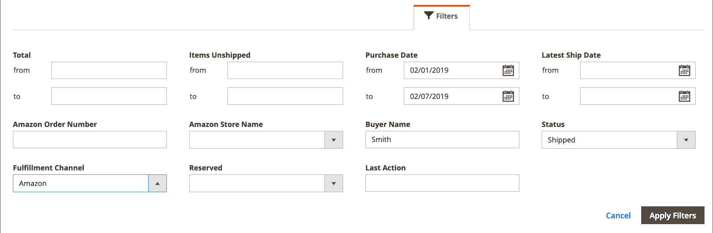

# 工作區控制項

Amazon銷售管道[首頁](./amazon-sales-channel-home.md)有一些常見的工作區控制項，包括「篩選器」、「預設視圖」、「列」和「導出」。 並非所有頁面都有相同的控制選項。

## 動作

_[!UICONTROL Actions]_選擇器提供可供頁面使用者使用的動作清單。 選取後，動作會套用至所有選取的項目。 要將操作應用於特定項目，請選中每個項目第一列中的複選框，然後在_[!UICONTROL Actions]_&#x200B;下選擇一個選項。

例如，當選取器顯示在&#x200B;_[!UICONTROL Attributes]_頁面上時，其中包含_[!UICONTROL Re-import Product Attribute Values]_&#x200B;動作。 選擇此動作會偵測對應的[!DNL Amazon Seller Central]帳戶，並針對左側欄中勾選的每個Amazon儲存項目重新整理[!DNL Commerce]資料。

## 篩選器

_[!UICONTROL Filters]_控制項顯示用於縮小表中所示資料的選項。 篩選選項是根據在「列」控制項中選取的列。 篩選選項只會針對在「欄」控制項中啟用的欄而顯示。

篩選器控制項可包含動態日曆，用於縮小指定日期的資料、具有預先定義選擇的欄的下拉式功能表，以及可包含自訂資料的自由文字欄位。

下列範例顯示篩選訂單清單的設定，以僅顯示符合下列條件的訂單：

- 下的訂單在2/01/2019到2/07/2019之間，
- 採購員名為`Smith`的訂單，以及
- 狀態為`Shipped`的訂單。

設定了篩選選項後，按一下&#x200B;**[!UICONTROL Apply Filters]**&#x200B;以篩選列出的資料。 按一下「取消」 ，退出「篩選器」控制項而不套用。

將篩選器套用至資料後，會顯示&#x200B;**[!UICONTROL Active Filters]**&#x200B;資訊。 您可以按一下圖示來清除特定的篩選器選項，或按一下&#x200B;**[!UICONTROL Clear All]**&#x200B;以清除所有已套用的篩選器。

## 檢視

「視圖」(View)控制項基於頁面的預設列，因此名為「預設視圖」(Default View)。 您可以使用「列」控制項添加或刪除可用列。 當您自訂欄時，您就可以在「檢視」控制項中將檢視儲存為自訂檢視。

當頁面上新增或移除欄時，會顯示：

1. 按一下「**[!UICONTROL Default View]** > **[!UICONTROL Save View As...]**」。

1. 輸入視圖的名稱。

1. 若要儲存自訂檢視，請按一下箭頭圖示。

在此範例中，_Order Id_&#x200B;欄會新增至欄控制項中，並儲存為自訂檢視。 請注意，自訂檢視名稱儲存後，檢視的名稱已從&#x200B;_預設檢視_&#x200B;變更為輸入的名稱。

您可以在&#x200B;_[!UICONTROL View]_功能表中選取所需的檢視，以在檢視之間切換。

如果您想要刪除或變更自訂檢視的名稱，請按一下鉛筆圖示。 然後您可以輸入不同的名稱，或按一下垃圾桶圖示以刪除自訂檢視。 無法刪除預設視圖。

## 欄

欄控制項可讓您從頁面顯示中新增或移除資料欄。 每個Amazon銷售管道頁面都有資料欄的預設組合，但大部分頁面都有其他可用欄。 如果沒有其他可用列，您仍可從顯示中刪除預設列。

以下範例顯示「欄」控制項。 核取的選項對應至頁面上顯示的欄標題。

- 若要將資料欄新增至頁面，請選取核取方塊。
- 若要從頁面中移除資料欄，請勿選取核取方塊。

核取方塊變更會立即顯示。 如果您進行變更並退出頁面，頁面會返回預設欄顯示。 對於您定期進行的更改，您可以在「視圖」控制項中將列更改另存為自定義視圖。 然後，您可以在「檢視」控制項中切換，而不需手動新增或移除欄。

您可以按一下&#x200B;**[!UICONTROL Reset]**&#x200B;將選項設回預設設定，或按一下&#x200B;**[!UICONTROL Cancel]**&#x200B;退出而不進行更改。

## 匯出

「導出」選項允許將資料導出到資料檔案，而不能導入到第三方軟體或單獨的資料庫。 匯出的資料僅限於顯示的資料。 如有需要，請務必先新增或移除欄，再使用「匯出」控制項。

準備好匯出資料時，請選擇匯出格式選項，然後按一下&#x200B;**[!UICONTROL Export]**。

- CSV — 包含純文字資料的逗號分隔值檔案
- Excel XML — 以XML為基礎的試算表資料格式（通常用於Excel使用者）

產生的資料檔案會自動儲存至您指定的資料夾以進行下載。

