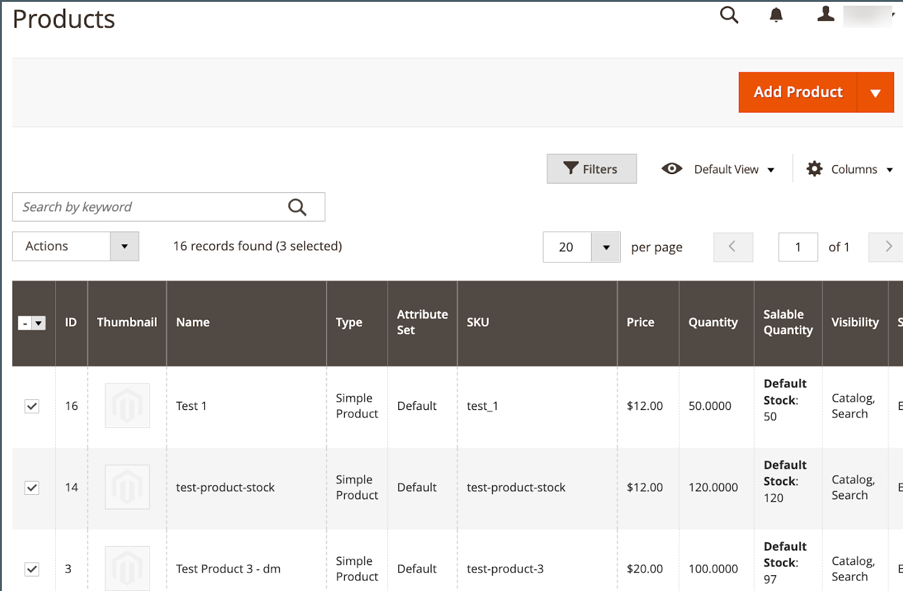

# 將產品新增至 [!DNL Channel Manager]

若要將產品新增至 [!DNL Walmart Marketplace] sales channel，請從 [!DNL Commerce] 產品目錄並將其匯入 [!DNL Channel Manager].
視您選取的產品數量而定，匯入程式最多可能需要30分鐘或更長時間。

## 先決條件

**[對應目錄屬性](map-catalog-attributes.md)** — 在 [!DNL Channel Settings] 設定，從以下位置至少對應一個屬性： [!DNL Commerce] 產品目錄至其中一個必要的沃爾瑪產品識別碼 — GTIN、ISBN、ISSN、UPC、EAN。

## 清單需求

[!DNL Commerce] 產品清單必須具備下列必要的屬性組態：

- **[!UICONTROL Connect to Channel Manager]** 屬性已啟用

- 為必要的Walmart屬性提供有效值。

   - 至少一個產品屬性符合其中一個必要屬性 [!DNL Walmart Marketplace] 產品識別碼 — GTIN、ISBN、ISSN、UPC、EAN。

   - 例如，產品價格指定至最多兩位小數 `9.99`

   - 例如，產品權重指定至最多兩位小數 `1.25`

>[!TIP]
>
>如需針對您的銷售管道最佳化清單的其他資訊，請參閱 [Walmart Marketplace清單品質最佳化指南](https://marketplace.walmart.com/wp-content/uploads/2020/09/WMP_listing_quality_optimization_guide.pdf).

## 新增產品

1. 從連線的銷售管道商店中，選取 **新增產品** 以開啟產品目錄。

   {width="600" zoomable="yes"}

   目錄會在新標籤中開啟。

1. 從目錄產品格線中，選取銷售產品 [!DNL Walmart Marketplace].

   {width="600" zoomable="yes"}

1. 啟用 **[!UICONTROL Connect to Channel Manager]** 所選專案的屬性。

   - 從 **[!UICONTROL Actions]**，選取 **[!UICONTROL Update attributes]**.

   - 捲動至 **[!UICONTROL Connect to Channel Manager]** 屬性並啟用它。

   - 確認產品屬性至少包含其中一個必要專案 [!DNL Walmart Product IDs].

   - 選取 **[!UICONTROL Save]**.

      確認訊息隨即顯示。

      {width="400"}

      如果訊息指出已排程更新，請使用 [佇列:consumers:開始](https://experienceleague.adobe.com/docs/commerce-operations/configuration-guide/cli/start-message-queues.html) [!DNL CLI] 立即處理更新的命令。

      ```bash
      $ bin/magento queue:consumers:start product_action_attribute.update
      ```

1. 匯入作業完成後，請回到以驗證您新增的產品 [!DNL Channel Manager] 並選取 **[!UICONTROL Listings]**.

   最初，產品位於 *草稿* 狀態。 選取 **[!UICONTROL Refresh products]** 以更新表格。

1. 選取「 」，更新檢視以顯示新增至「管道管理員」的新產品 **[!UICONTROL Draft]** 狀態卡。

   {width="400" zoomable="yes"}


