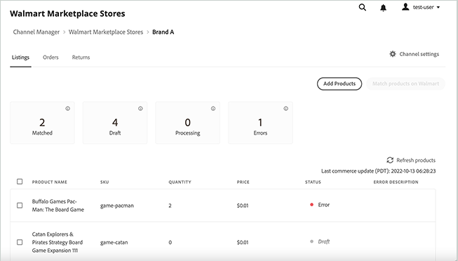

# 管理清單

管理產品清單 [!DNL Walmart Marketplace] 銷售渠道。

單個清單的「狀態」(Status)指明產品在 [!DNL Channel Manager] 工作流，以便您可以確定後續步驟並解決任何錯誤。

您可以從「清單」視圖完成以下任務。

* 查看當前清單
* 排序和篩選清單
* 添加產品
* 匹配產品
* 跟蹤清單狀態
* 查看清單的錯誤描述，該清單具有錯誤狀態

## 查看產品清單

1. 從管理員，轉到 [!UICONTROL **營銷** > **渠道管理器**]。

1. 從「商店」清單中，選擇商店條目行中的眼睛表徵圖以開啟商店視圖。

1. 選擇 [!UICONTROL **清單**]。

1. 排序 *清單* 通過在 *清單* 的子菜單。

1. 篩選 *清單* 查看。

1. 通過選擇 **刷新產品**。

## 添加 [!DNL Commerce] 產品到Channel Manager

為 [!DNL Walmart Marketplace] 完成以下任務：

* [添加您的產品 [!DNL Commerce] 產品目錄 [!DNL Channel Manager]](add-products-to-channel-store.md)

* [映射目錄屬性](map-catalog-attributes.md#configure-product-attribute-settings)

## 匹配上的產品 [!DNL Walmart]

您可以在 [!DNL Walmart Marketplace] 使用產品匹配或手動上載新產品的產品清單。

* **[在沃爾瑪上匹配產品](connect-listings-to-marketplace.md)** — 將產品清單從渠道連接到 [!DNL Walmart Marketplace] 通過更新銷售相同產品的現有清單。 匹配條件由 [屬性映射配置](map-catalog-attributes.md) 你的頻道。

* **[手動上載新清單](connect-listings-to-marketplace.md#upload-new-product-listings)** — 對於與上現有清單不匹配的產品 [!DNL Walmart Marketplace]，使用 [!DNL Walmart] 產品類別Excel模板，以批量上載產品清單。

## 列出控制項和列說明

下表介紹了可用於 [!UICONTROL Listings]。

**控制項[!UICONTROL Listings]**

| **控制項** | **說明** |
|----------------------------------------|--------------------------------------------------------------------------------------------------------------------------------------------------------------------------------------------------------------|
| [!UICONTROL Add Products] | 開啟 [!UICONTROL Admin Product Catalog] 頁面選擇要添加到 [!DNL Walmart Marketplace] 或更新產品屬性以滿足沃爾瑪市場清單要求。 |
| [!UICONTROL Match products on Walmart] | 在選擇一個或多個處於「草稿」狀態的產品後，選擇「匹配產品」(Match products on) [!DNL Walmart] 檢查是否可以添加到現有產品中 [!DNL Walmart Marketplace] 清單。 |
| [!UICONTROL Refresh products] | 使用最新清單和狀態更新顯示。 此控制項還將清單視圖重置為預設排序順序並刪除任何篩選器。 |
| [!UICONTROL Filter by *狀態*] | 通過選擇「清單」表上方的狀態計數卡之一，只顯示具有特定狀態的清單。 使用 *刷新產品* 按鈕。 |
| [!UICONTROL Sort products] | 通過選擇任何列標題更改清單的排序順序。 |

**列說明**

| **欄位** | **說明** |
|--------------------------------|-------------------------------------------------------------------------------------------------------------------------------------------------------------------------------------------------------------------------------------------------------------------------------------------------------------------------------------------------------------------|
| [!UICONTROL Product name] | 來自的產品名稱 [!DNL Commerce] 儲存目錄。 |
| [!UICONTROL SKU (Unique ID)] | 分配給產品的SKU [!DNL Commerce] 目錄。 |
| [!UICONTROL  Quantity] | 在Adobe Commerce或Magento Open Source的庫存量。 |
| [!UICONTROL Price] | 來自 [!DNL Commerce] 儲存目錄。 目錄價格更新將同步到Channel Manager，然後發送到 [!DNL Walmart Marketplace]  讓列出的項目顯示當前價格。 |
| [!UICONTROL Status] | 指示中的當前訂單狀態 [!DNL Commerce] 訂單工作流。 成功將產品添加到時的狀態更新 [!DNL Channel Manager] 和市場上的產品匹配。 如果操作失敗，清單將顯示錯誤狀態。 修復錯誤後， [!DNL Channel Manager] 重試該操作並更新狀態。 |
| [!UICONTROL Error Description] | 提供具有 `[!DNL Error]` 狀態。 |
| [!UICONTROL Status Detail] | 提供產品的其他資訊 *錯誤* 或 *匹配* 狀態。 |

### 關於清單狀態

在「清單」工作區中，「狀態」標籤顯示產品在 [!DNL Channel Manager] 工作流，以便您可以確定後續步驟並解決錯誤。 清單可以具有以下狀態標籤：

* **[!UICONTROL Draft]** — 標識尚未 [已提交 [!DNL Walmart] 匹配](connect-listings-to-marketplace.md#match-products)。

* **[!UICONTROL Processing]** — 標識提交以在 [!DNL Walmart Marketplace]。 產品仍在 *處理* 狀態直到 [!DNL Walmart] 返回HTTP狀態消息，該消息指示匹配是否成功或是否出現錯誤。 要完成匹配操作，最多需要30分鐘 [!DNL Walmart Marketplace]。

* **[!UICONTROL Match]** — 標識成功匹配的產品 [!DNL Walmart]。

   當產品屬性值（例如，UPC代碼）與現有產品中的UPC值匹配時，會出現匹配 [!DNL Walmart Marketplace] 清單。 當產品匹配時，將將Commerce產品優惠添加到現有清單中。

   檢查 [[!UICONTROL Walmart Marketplace Seller Account Items]](https://seller.walmart.com/items-and-inventory/manage-items) 控制面板：複查更新的產品清單並驗證產品詳細資訊、價格和庫存數量。

* **[!UICONTROL Match - Match in Stage]** — 標識與 [!DNL Walmart] 直到 [!DNL Walmart Marketplace] 商店是即時的。 具有此狀態的產品在 [!DNL Walmart Marketplace] 商店就要開始了。

* **[!UICONTROL Error]** — 標識與現有產品不匹配的產品 [!DNL Walmart Marketplace] 清單。

* **[!UICONTROL Error description]** — 提供有關清單錯誤的詳細資訊。

   解決錯誤後，請重新提交產品以進行匹配。 請參閱 [排除產品匹配錯誤](connect-listings-to-marketplace.md#troubleshoot-product-match-errors)。
