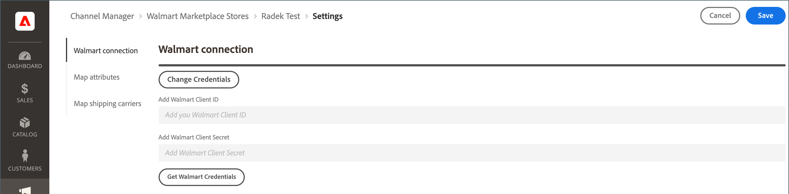

# 映射運輸承運人

在你之前 [處理訂單發運](process-orders.md#ship-an-order) 為 [!DNL Walmart Marketplace] 訂單，將沃爾瑪青睞的貨運公司映射到 [!DNL Commerce] 這樣，運輸資料就可以在 [!DNL Walmart] 和 [!DNL Commerce]。

不映射到首選承運人的商業承運人被標籤為 *[!UICONTROL Other Carrier]* 上 [!DNL Walmart]。

**先決條件**

審閱 [沃爾瑪要求](walmart-requirements.md) 為 [!DNL Marketplace Seller account]。

## 更新連接憑據

1. 在 [!UICONTROL Listings] 頁，選擇 **[!UICONTROL Channel Settings]**。

1. 開 **[!UICONTROL Channel Settings]**&#x200B;選中 **[!UICONTROL Walmart Connection]**。

1. 要修改憑據，請選擇 **[!UICONTROL Change Credentials]**

   

1. 輸入 **[!UICONTROL Walmart Client ID]** 和 **[!UICONTROL Walmart Client Secret]**。

1. 選擇 **[!UICONTROL Save]** 按鈕。
