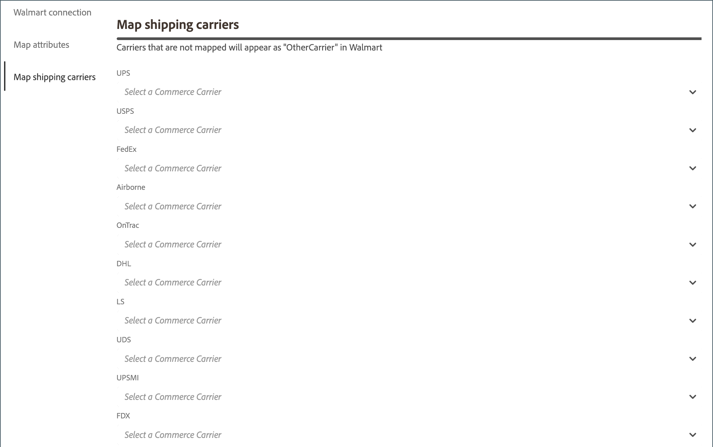

# 映射運輸承運人

在您之前 [處理訂單發運](process-orders.md#ship-an-order) for [!DNL Walmart Marketplace] 訂單，將沃爾瑪的優先承運商映射為 [!DNL Commerce] 以便在 [!DNL Walmart] 和 [!DNL Commerce].

未對應至偏好電信業者的商務電信業者會標示為 *[!UICONTROL Other Carrier]* on [!DNL Walmart].

**必要條件**

在映射發運承運人之前，請完成以下任務：

1. 檢閱 [按時交貨的承運人方法和發運最佳做法](https://sellerhelp.walmart.com/s/guide?article=000009473) for [!DNL Walmart Marketplace].

1. 驗證 [[!UICONTROL Shipping Carrier]](https://docs.magento.com/user-guide/shipping/carriers.html) 和 [[!UICONTROL Shipping Settings]](https://docs.magento.com/user-guide/configuration/sales/shipping-settings.html) 配置 [!DNL Commerce] 儲存，以確保已針對 [!DNL Walmart Marketplace sales].

## 映射運輸承運人

1. 從 **[!UICONTROL Listings]** 或 **[!UICONTROL Orders]** 頁面，選取 **[!UICONTROL Channel Settings]**.

1. 開啟 **[!UICONTROL Channel Settings]**，選取 **[!UICONTROL Shipping Carriers]**.

   

1. 針對每個 [!DNL Walmart] 列出首選電信業者，請選取 [!DNL Commerce] 如果電信業者可用，請從下拉式清單中取得電信業者名稱。

1. 選擇 **[!UICONTROL Save]** 來套用設定。

