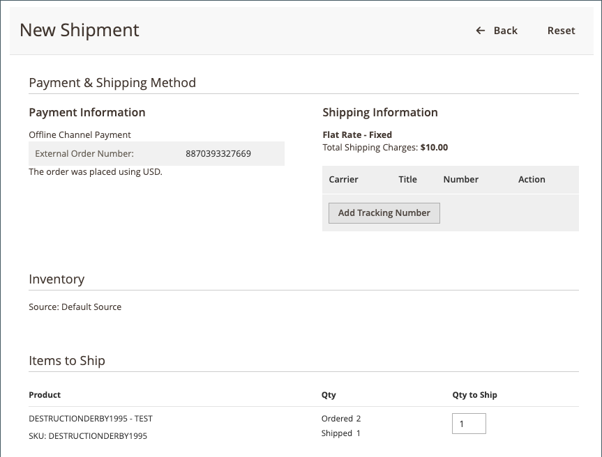

# 處理訂單

在確認[!DNL Walmart Marketplace]訂單並成功傳送至[!DNL Channel Manager]後，您可使用[Commerce Order Management](https://experienceleague.adobe.com/docs/commerce-admin/stores-sales/order-management/orders/orders.html#orders-workspace)處理訂單。

管道管理員會同步處理對[!DNL Walmart Marketplace]的更新，以確保來自[!DNL Commerce]的訂單狀態和送貨資訊與[!DNL Walmart Marketplace]中追蹤的資料相符。

* **訂單出貨** — 沃爾瑪需要所有出貨的追蹤編號。 如果部份料號缺貨，您可以建立部份出貨，以傳送目前可用的料號。 在您提交出貨後，訂單更新會同步處理至[!DNL Walmart Marketplace]。 然後，沃爾瑪會通知客戶訂單狀態和運送細節。

* **訂單取消** — 當您取消[!DNL Walmart Marketplace]訂單時，Walmart會要求取消原因，此原因包含在傳送給客戶的訂單取消通知中。 取消原因也顯示在[!DNL Commerce]訂單付款資訊中。 在您提交取消之後，詳細目錄更新會同步處理至[!DNL Walmart Marketplace]。 然後，沃爾瑪會通知客戶訂單狀態和運送細節。

  在店面，您必須取消整個訂單。 [!DNL Commerce]不允許部分取消。

* **退款要求** — 如果沃爾瑪市集退貨是要求送貨的訂單，則[!UICONTROL Status details]會包含退貨的連結。 從[退貨](return-refund-orders.md)儀表板管理退款和退款。

當Commerce訂單已處理且[!DNL Channel Manager]已順利將出貨、部份出貨及取消更新同步至[!DNL Walmart Marketplace]時，訂單處理即完成。 已出貨訂單的退貨請求與退款是從[退貨](return-refund-orders.md)儀表板管理。

>[!NOTE]
>
> 最多可能需要5分鐘的時間才能將訂單更新同步處理至[!DNL Walmart Marketplace]。 若要檢查訂單狀態，請返回[!DNL Channel Manager]訂單頁面。

## 出貨訂單

1. 從Admin中，選取&#x200B;**[!UICONTROL Marketing]** > **[!UICONTROL Channel Manager]**。

1. 選取銷售管道商店的眼睛圖示，以開啟商店檢視。

1. 若要檢視[!DNL Walmart Marketplace]個訂單，請選取&#x200B;**[!UICONTROL Orders]**。

1. 在「訂單」表格中，選取&#x200B;**[!UICONTROL Commerce Order Number]**&#x200B;以開啟要出貨的訂單。

1. 選取&#x200B;**[!UICONTROL Ship]**，為全部或部份訂單建立並提交出貨。

   [!DNL Walmart Marketplace]訂單的{width="600" zoomable="yes"}

   * 選擇運送公司，並選取&#x200B;**[!UICONTROL Add tracking number]**&#x200B;以新增追蹤號碼。

     [!DNL Walmart Marketplace]訂單的{width="600" zoomable="yes"}

   * 視需要完成其餘的送貨表格。 如需詳細指示，請參閱[[!DNL Shipping an Order]](https://experienceleague.adobe.com/docs/commerce-admin/stores-sales/order-management/orders/order-ship.html)。

1. 送出之後，追蹤[!DNL Channel Manager]中的[訂單狀態](manage-orders.md#about-order-status)，以確認更新已傳送至[!DNL Walmart Marketplace]。

在訂單出貨後，您可以根據從[!DNL Walmart Marketplace]收到的退貨要求，處理訂單中包含之料號的[!DNL Channel Manager]全部或部分退款。 請參閱[退貨和退款訂單](return-refund-orders.md)。

## 取消訂單

1. 從Admin中，選取&#x200B;**[!UICONTROL Marketing]** > **[!UICONTROL Channel Manager]**。

1. 選取銷售管道商店的眼睛圖示，開啟商店檢視。

1. 若要檢視[!DNL Walmart Marketplace]個訂單，請選取*[!UICONTROL Orders]**。

1. 在「訂單」表格中，選取要取消的訂單&#x200B;**[!UICONTROL Commerce Order Number]**&#x200B;以開啟[訂單詳細資料頁面](manage-orders.md#view-order-detail)。

   [!DNL Walmart Marketplace]訂單的{width="600" zoomable="yes"}

1. 取消訂單。

   * 從「訂單詳細資料」功能表選取&#x200B;**取消**。

   * 在[!UICONTROL Cancel Order]表單上，選取&#x200B;**[!UICONTROL Cancellation reason]**。

   [!DNL Walmart Marketplace]訂單的{width="600" zoomable="yes"}

   * 選取&#x200B;**[!UICONTROL Cancel Order]**。

1. 送出取消之後，追蹤[!DNL Channel Manager]中的[訂單狀態](manage-orders.md#about-order-status)，以確認更新已傳送至[!DNL Walmart Marketplace]。

## 修正訂單錯誤

在[!DNL Walmart Marketplace]的訂單同步處理期間，或在出貨、部份出貨及取消的訂單更新處理期間，可能會發生錯誤。

如果出貨、部份出貨或取消更新的同步化作業失敗，[!DNL Channel Manager]訂單頁面會顯示訂單的&#x200B;_錯誤_&#x200B;狀態。 為了確保出貨資訊和訂單取消資訊能正確反映在Walmart Marketplace帳戶中，請手動更新[!DNL Walmart Marketplace]商店中的訂單。

