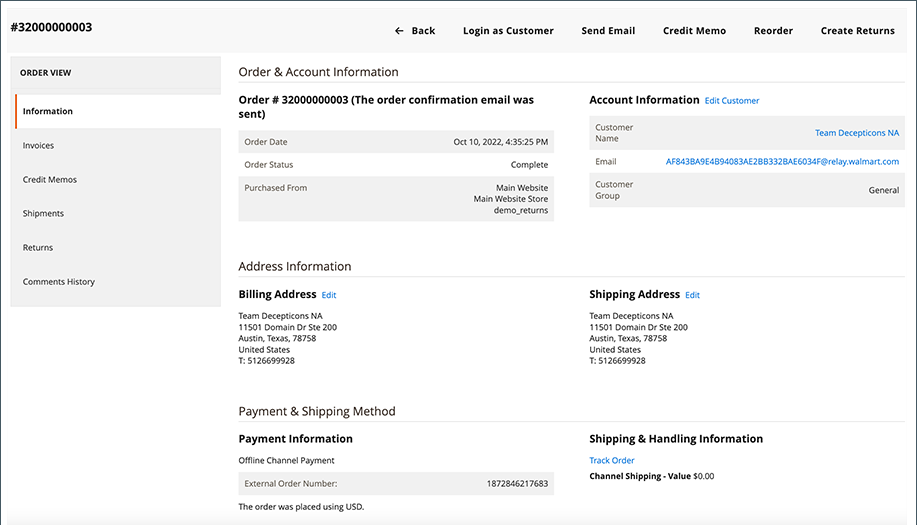
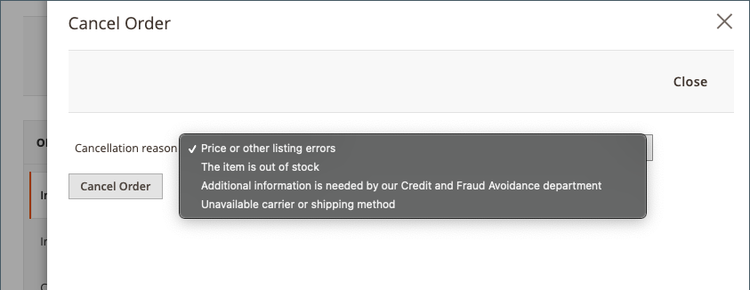

# 處理訂單

如果您使用Adobe Commerce和Magento Open Source訂單管理管理 [!DNL Commerce] 商店銷售，流程 [!DNL Walmart Marketplace] Commerce的訂單。

在Commerce中處理訂單時，Channel Manager將更新同步到 [!DNL Walmart Marketplace]。 此更新確保Commerce的訂單狀態和發運資訊與在 [!DNL Walmart Marketplace]。

* **訂單發運** — 沃爾瑪要求所有發貨的跟蹤編號。 如果庫存數量不足以填充整個訂單，則建立部分發運。 提交發運後，訂單更新將同步到 [!DNL Walmart Marketplace]。 然後，沃爾瑪會通知客戶訂單狀態和發貨詳細資訊。

* **訂單取消** — 當取消 [!DNL Walmart Marketplace] 而沃爾瑪則要求取消訂單。 取消原因包括在發送給客戶的訂單取消通知中。 取消原因也顯示在 [!DNL Commerce] 訂單付款資訊。

>[!NOTE]
>
> 訂單更新可同步至 [!DNL Walmart Marketplace]。 要檢查訂單狀態，請返回至 [!DNL Channel Manager] 訂單頁。

## 發運訂單

1. 在管理員中，選擇 **[!UICONTROL Marketing]** > **[!UICONTROL Channel Manager]**。

1. 通過為銷售渠道商店選擇眼睛表徵圖開啟商店視圖。

1. 查看 [!DNL Walmart Marketplace] 訂單，選擇*[!UICONTROL *Orders]**。

1. 在「訂單」表中，通過選擇 **商業訂單編號**。

1. 通過選擇 **[!UICONTROL Ship]**。

   

   * 要選擇發運承運人並添加跟蹤編號，請選擇 **[!UICONTROL Add tracking number]**。

   * 根據需要填寫其餘的裝運單。 請參閱 [[!DNL Shipping an Order]](https://docs.magento.com/user-guide/sales/order-ship.html) 的上界。

1. 提交發運後，跟蹤 [訂單狀態](manage-orders.md#about-order-status) 在 [!DNL Channel Manager] 驗證更新已發送到 [!DNL Walmart Marketplace]。

## 取消訂單

1. 在管理員中，選擇 **[!UICONTROL Marketing]** > **[!UICONTROL Channel Manager]**。

1. 通過為銷售渠道商店選擇眼睛表徵圖開啟商店視圖。

1. 查看 [!DNL Walmart Marketplace] 訂單，選擇*[!UICONTROL *Orders]**。

1. 在「訂單」表中，通過選擇 **商業訂單編號** 訂單。

1. 取消訂單。

   * 選擇 **取消** 按鈕。

   * 在 [!UICONTROL Cancel Order] ，請選擇 **取消原因**。

   

   * 選擇 **取消訂單**。

1. 驗證是否已將更新發送到 [!DNL Walmart Marketplace] 通過檢查 [訂單狀態](manage-orders.md#about-order-status) 在 [!DNL Channel Manager]。
