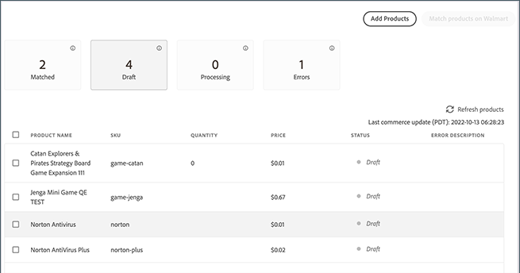
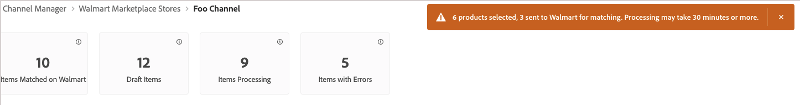
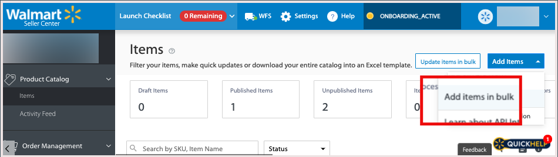
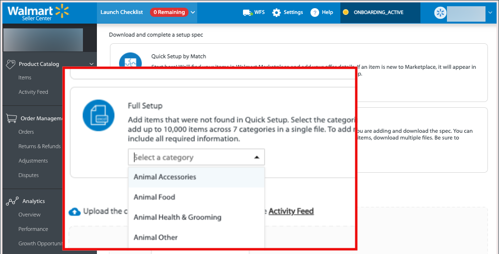

# 向沃爾瑪發佈清單

和其他市場一樣， [!DNL Walmart] 允許第三方銷售者列出他人銷售的商品。

該平台使用UPC和GTIN等產品標識符來匹配現有的 [!DNL Walmart Marketplace] 清單。
對於匹配的產品，在您發佈產品時，Walmart Marketplace會列出更新以包括Commerce產品選項 [!DNL Channel Manager]。

通常，價格最低的產品在 [!DNL Walmart Marketplace] 上市，但評論等其它因素也會影響位置。

## 匹配產品

當您匹配產品時，Channel Manager會將產品資料發送到 [!DNL Walmart Marketplace] 搜索具有與映射的Commerce產品屬性匹配的屬性值的現有清單。 匹配條件由 [屬性映射配置](map-catalog-attributes.md) 你的商店頻道。

如果找到匹配項，則更新現有產品清單以添加您的優惠。

### 先決條件

在匹配產品之前，請驗證您的產品目錄屬性值是否滿足Walmart要求並配置屬性設定。 請參閱 [映射目錄屬性](map-catalog-attributes.md)。

#### 選擇並匹配產品

1. 開啟連接的銷售渠道。

1. 從 **[!UICONTROL Listings]**，選擇要匹配的產品 *[!UICONTROL Draft]* 狀態。

   

1. 選擇 **[!UICONTROL Match Products]**。

   一條消息指示發送以進行匹配的產品數。

   

   所選產品的狀態更改為 [!UICONTROL *處理*] 直到匹配操作完成。 沃爾瑪市場完成比賽可能需要30分鐘。

### 檢查匹配狀態

1. 選擇 **刷新產品** 查看當前產品狀態。

1. 檢查產品狀態。

匹配完成後，狀態可以是 *匹配* 或 *錯誤*。

* **[!UICONTROL Match]** 表示產品已成功匹配。 您的產品服務已發佈到現有的沃爾瑪市場清單中。 如果 [Marketplace商店不活動](walmart-prerequisites.md#walmart-marketplace-store-status)。 *[!UICONTROL Staged for Match]* 中 *[!UICONTROL Status detail]* 的雙曲餘切值。

如果 [[!DNL Walmart Marketplace] 儲存不活動](walmart-prerequisites.md#walmart-marketplace-store-status)，也請參見Wiki頁。 *狀態詳細資訊* 列指示產品 *為匹配轉移*。 在 [!DNL Walmart Marketplace] 儲存已激活。

* **[!UICONTROL Error]** 指示匹配操作由於以下問題之一而失敗：

   * [!DNL Channel Manager] 由於連接問題，無法發送匹配。

   * 找不到匹配項。

   * 找到匹配項，但無法發佈清單，因為 [!DNL Walmart Marketplace] 返回了錯誤代碼。 請參閱 *狀態詳細資訊**，獲取錯誤說明。

### 查看沃爾瑪上市

匹配產品後，複查更新的產品清單並驗證產品詳細資訊、價格和庫存數量 [[!UICONTROL Walmart Marketplace Seller Account Items] 儀表板](https://seller.walmart.com/items-and-inventory/manage-items) 查看更新的產品。

### 排除產品匹配錯誤

如果產品匹配操作失敗並出現錯誤，則錯誤消息將顯示在 *[!UICONTROL Status detail]* 列 [!UICONTROL Channel Manager] 產品清單。

返回的常見錯誤格式不正確或缺少必需的屬性。

#### 修復產品ID值

| 類型 | 說明 | 示例 |
|------|--------------------------------------------------------------------------------------------------------------------------------------------------------------------------------|---------------------------------------------|
| UPC | GTIN-12,12位數，包括校驗位。   如果UPC少於12位數（如8位的UPC-E），則添加尾零以滿足要求。 | 更改自 `45678912345` 至 `045678912345` |
| 格丁 | GTIN-14,14位數，包括校驗位。   如果GTIN少於14位，請添加前導零  才能滿足要求。 | 更改 `456789123456` 至 `0045678912345` |
| EAN | GTIN-13,13位數，包括校驗位。   如果EAN少於13位，請添加行距  零以滿足要求。 | 更改自 `4567891234` 至 `0004567891234` |

有關Walmart Marketplace錯誤代碼的詳細資訊，請參閱 [沃爾瑪賣家幫助](https://sellerhelp.walmart.com/s/guide?article=000005844)。

## 上載新產品清單

對於在沃爾瑪市場上沒有匹配項的產品，請使用沃爾瑪產品類別Excel模板批量上傳產品清單。 您使用從您的Commerce實例導出的產品目錄資料填充Walmart模板。

對於新產品清單，請檢查您的產品目錄以確保您計畫在沃爾瑪市場銷售的產品具有沃爾瑪市場產品清單所需的屬性。

**Walmart Marketplace清單 — 屬性要求**

| **屬性** | **需求級別** |
|--------------------------|-----------------------|
| SKU | 必需 |
| 產品名稱 | 必需 |
| 產品ID類型 | 必需 |
| 產品ID | 必需 |
| 品牌 | 必需 |
| 簡短描述 | 必需 |
| 銷售價格 | 必需 |
| 站點說明 | 必需 |
| 主影像URL | 必需 |
| 裝運重量 | 必需 |
| 關鍵功能 | 推薦 |
| 型號 | 推薦 |
| 製造商名稱 | 推薦 |
| 製造商部件號 | 推薦 |
| 大小 | 推薦 |
| 顏色 | 推薦 |
| 主影像URL | 可選 |
| 其他影像URL | 可選 |
| 製造商 | 可選 |

### 先決條件

* 驗證您是否遇到 [沃爾瑪先決條件](walmart-prerequisites.md)。

* 在您的Commerce產品目錄中，驗證要在Walmart Marketplace上列出的產品的目錄配置是否具有所有必需的屬性，並符合Walmart Marketplace內容指南。

* 驗證cron作業是否正在運行以完成導出操作。

   * 有關內部實例，請參見 [配置並運行cron](https://devdocs.magento.com/guides/v2.4/config-guide/cli/config-cli-subcommands-cron.html)。

   * 有關Adobe雲基礎架構，請參見 [設定克隆作業](https://devdocs.magento.com/cloud/configure/setup-cron-jobs.html)。

### 建立要上載的產品資料檔案

1. 從 [沃爾瑪賣家帳戶](https://login.account.wal-mart.com/authorize?responseType=code&amp;clientId=66620dfd-1f3f-479b-8b9c-e11f36c5438b&amp;scope=openId&amp;redirectUri=https://seller.walmart.com/resource/login/sso/torbit&amp;nonce=SX17QLMBKR&amp;state=ZBWWNZXXXM&amp;clientType=seller)，從沃爾瑪賣家中心下載產品清單模板。

   * 在「產品目錄項」頁中，選擇 **[!UICONTROL Add Items]**。 然後，選擇 **[!UICONTROL Add items in bulk]**。

      

   * 在下載頁面上，選擇 **[!UICONTROL Full Setup]**。 然後，選擇項目類別並下載類別模板。

      

   * 驗證模板是否包含產品清單的必需屬性和推薦屬性。

1. 從 [!DNL Commerce] 管理員，選擇要從您的Adobe Commerce站點導出的產品資料。

   * 在管理員中，選擇 [!UICONTROL **系統** >資料傳輸> **導出**]。

   * 在 [!UICONTROL Export] 的 [!UICONTROL Entity Type] 欄位，選擇 [!UICONTROL **產品**]。

   * 在 [!UICONTROL Entity Attributes] 中，配置產品資料導出的選擇標準。
   ![導出產品資料頁 [!UICONTROL Commerce Admin]](assets/walmart-seller-account-full-setup-download.png)

   使用篩選器來選擇和配置適用於您銷售的產品類別的屬性值。 確保包括沃爾瑪的必需屬性和推薦屬性(請參閱 [導出資料](https://docs.magento.com/user-guide/system/data-export.html) 詳細說明，請參閱《Adobe Commerce使用手冊》。)

   要從導出中忽略屬性，請選擇 [!UICONTROL **排除**] 的子菜單。

1. 滾動到屬性表的末尾，然後選擇 [!UICONTROL **繼續**] 中設定網格顏色。

   CSV導出檔案通過使用cron作業的消息隊列進行處理並保存在 `var/export/folder`。 (請參閱 [管理消息隊列](https://devdocs.magento.com/guides/v2.4/config-guide/mq/manage-message-queues.html) 的 *《 Commerce Developer Guide》*。)

1. 開啟Walmart Marketplace產品類別的Excel模板，並使用Excel宏功能將導出的產品資料合併到Excel模板中。

1. 使用導出的產品資料上載Excel檔案。

   * 返回到中的「產品目錄項」頁 [沃爾瑪賣家中心](https://login.account.wal-mart.com/authorize?responseType=code&amp;clientId=66620dfd-1f3f-479b-8b9c-e11f36c5438b&amp;scope=openId&amp;redirectUri=https://seller.walmart.com/resource/login/sso/torbit&amp;nonce=SX17QLMBKR&amp;state=ZBWWNZXXXM&amp;clientType=seller)。

   * 選擇 [!UICONTROL **添加項目** > **批量添加項目**]。
   * 將已完成的電子錶格拖到「上載」部分。
   * 選擇 [!UICONTROL **提交**]。
   * 選擇&#x200B;[!UICONTROL  **活動源**] 的子菜單。

有關完整說明，請參見 [使用完整項目規範批量添加項目](https://sellerhelp.walmart.com/s/guide?article=000007680) 的 [!DNL *沃爾瑪賣家幫助*]。
